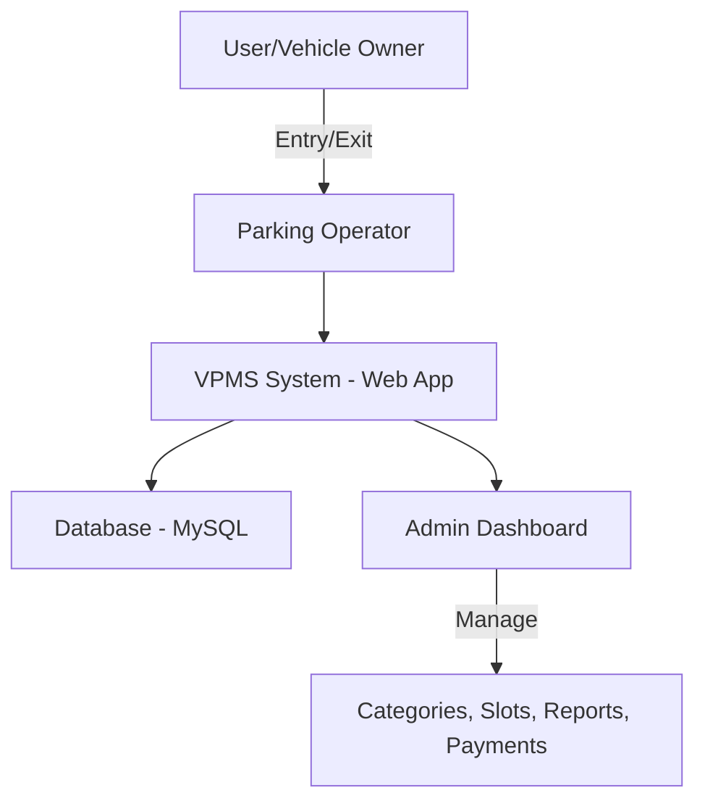

# 🚗 Vehicle Parking Management System (VPMS)

## 📌 Project Overview

The **Vehicle Parking Management System (VPMS)** is a **web-based application** built with **PHP & MySQL** to streamline and automate the management of vehicle parking facilities.
It enables **admins** to manage categories, slots, vehicle entries, and payments, while **users** can check in/out their vehicles efficiently.

This system is designed for **colleges, offices, malls, and public parking areas** to eliminate manual records and provide digital management.

---

## 🎯 Objectives

* Efficiently manage **vehicle entries and exits**.
* Categorize vehicles (2-wheeler, 4-wheeler, etc.).
* Track **parking slots availability**.
* Maintain a **digital record of payments**.
* Provide **admin authentication & role-based access**.
* Reduce human errors and manual paperwork.

---

## ⚙️ System Architecture



---

## 🖥️ Tech Stack

### 🔹 Frontend

* HTML, CSS, Bootstrap
* JavaScript (jQuery)

### 🔹 Backend

* PHP (Core PHP, procedural)

### 🔹 Database

* MySQL (XAMPP / LAMP / WAMP)

### 🔹 Server

* Apache Server

---

## 📊 Features

* 🔑 **Admin Authentication**: Secure login, forgot password & reset.
* 🚘 **Vehicle Entry/Exit**: Record and update check-in/check-out details.
* 📂 **Category Management**: Add/Edit/Delete vehicle categories.
* 💰 **Payment Tracking**: Manage parking fees for different categories.
* 📑 **Reports & History**: Generate reports of parked vehicles.
* 📡 **Responsive UI**: Mobile-friendly dashboard.

---

## 🛠️ Installation & Setup

### 🔹 Requirements

* PHP 7+
* MySQL 5.7+
* XAMPP / WAMP / LAMP

### 🔹 Steps to Run

1. **Clone the Repository**

   ```bash
   git clone https://github.com/Milind1234/Vehicle-Parking-Management-System.git
   ```

2. **Move Project to Server Directory**

   * For XAMPP: Place inside `htdocs/`
   * For WAMP/LAMP: Place inside `www/`

3. **Create Database**

   * Open **phpMyAdmin**
   * Create a database:

     ```sql
     CREATE DATABASE vpms;
     ```
   * Import `database/vpms.sql` file.

4. **Configure Database Connection**

   * Open `includes/dbconnection.php`
   * Update with your MySQL credentials:

     ```php
     $con = mysqli_connect("localhost","root","","vpms");
     ```

5. **Start Apache & MySQL** using XAMPP/WAMP/LAMP.

6. **Run the Application**

   * Open in browser:

     ```
     http://localhost/Vehicle-Parking-Management-System/vpms/
     ```

---

## 🔐 Default Admin Credentials

* **Username:** `admin`
* **Password:** `admin123`
  *(Can be changed later in the dashboard)*

---

## 📷 Screenshots

### 🔹 Admin Login Page


### 🔹 Dashboard


### 🔹 Vehicle Entry Form


### 🔹 Category Management


---

## 🚀 Future Enhancements

* 📱 Mobile App (Android/iOS) integration.
* 🎟️ QR code / RFID based parking.
* 🛰️ IoT Sensors to auto-detect slots.
* ☁️ Cloud deployment for multi-location parking.

---

## 👨‍💻 Contributors

* **Milind Chavan** – Project Lead & Developer
* Team Members – UI/UX, Database, Documentation

---

## 📜 License

This project is licensed under the **MIT License** – feel free to use and modify with attribution.
